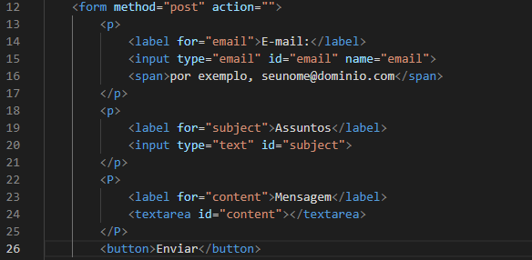

# Elementos de formulário de cadastro

## Código do projeto
 

## `form`
O elemento HTML &lt;form&lt; representa uma seção do documento contendo controles interativos para envio de informações.

  - `method` - encontrado na linha 12 - É um atributo HTTP para enviar o formulário. Os únicos métodos/valores permitidos são (sem distinção entre maiúsculas e minúsculas):

  - `post` - encontrado na linha 12 - O atributo POST; dados do formulário enviados como o corpo da solicitação.

  - `action` - encontrado na linha 12 - A URL que processa o envio do formulário. Este valor pode ser substituído por um atributo formaction em um elemento &lt;button&gt;, &lt;input type="submit"&gt; ou &lt;input type="image"&gt;. Este atributo é ignorado quando method="dialog" é definido.

## `label`
* encontrado nas linhas 14, 19 e 23

O ID de um elemento de formulário relacionados com labelable no mesmo documento como o elemento label. O primeiro elemento tal no documento com uma ID correspondente ao valor do atributo é o controle marcado for este elemento etiqueta.

  - `for` -  encontrado nas linhas 14, 19 e 23 - O valor do foratributo deve ser único idpara um elemento rotulável relacionado ao formulário no mesmo documento que o &lt;label&gt; elemento. Portanto, qualquer labelelemento pode ser associado a apenas um controle de formulário.

## `input`
* encontrado nas linhas 15 e 20

O tipo de controle a ser exibido. O tipo padrão é text, se este atributo não for especificado. Os valores possíveis são:

  - `type` - encontrado nas linhas 15 e 20 - Uma string especificando o tipo de controle a ser renderizado. Por exemplo, para criar uma caixa de seleção, checkboxé usado um valor de. Se omitido (ou um valor desconhecido for especificado), o tipo de entrada textserá usado, criando um campo de entrada de texto simples.

  - `email` - encontrado nas linhas 14 e 15 - Um campo para editar um endereço de e-mail. O valor do campo é validado para estar vazio ou ter um único endereço de e-mail válido antes de ser enviado. As pseudoclasses CSS :valid e :invalid são aplicadas apropriadamente.

  - `id` - encontrado nas linhas 15, 20 e 24 - Atributo global válido para todos os elementos, incluindo todos os tipos de entrada, define um identificador único (ID) que deve ser único em todo o documento. Sua finalidade é identificar o elemento durante a vinculação. O valor é usado como o valor do atributo &lt;label&lt; forpara vincular o rótulo ao controle de formulário. tem menu de contexto

  - `name` - encontrado na linha 15 - O nome do controle, que é enviado junto com os dados do formulário.

## `span`
* encontrado na linha 16

O elemento HTML &lt;span&gt; é um conteiner generico em linha para conteúdo fraseado , que não representa nada por natureza. Ele pode ser usado para agrupar elementos para fins de estilo (usando os atributos class ou id ), ou para compartilhar valores de atributos como lang. 

## `textarea`
* encontrado na linha 24

O elemento HTML &lt;textarea&gt; representa um controle de edição para uma caixa de texto, útil quando você quer permitir ao usuário informar um texto extenso em formato livre, como um comentário ou formulário de retorno.

- `id` - encontrado na linha 24 - Um atributo id para permitir que &lt;textarea&gt; seja associado a um elemento &lt;label&gt; para fins de acessibilidade.

## `button`
* encontrado na linha 26

O Elemento HTML &lt;button&gt; representa um botão clicável.

